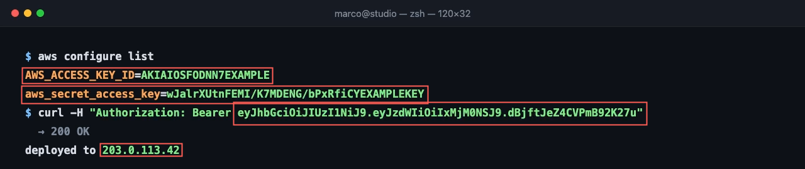
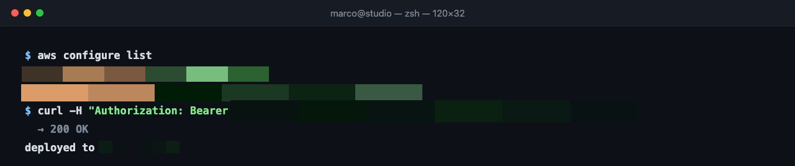

# ScreenSafe

**The privacy linter for video.**

Video leaks more than people expect, and usually for only a moment. An API key
sits in a terminal for a second and a half at 0:47 while you tab between
windows. A customer's email is on screen while you demo a dashboard. Somebody
walks through the background of a shot. A QR code stays in frame long enough to
scan. None of it survives playback review, and all of it ships in every copy of
the video.

ScreenSafe is the check you run before publishing. Drop in a video. It samples
the footage, analyzes the frames where something changed, and finds sensitive
text, faces, and QR codes. You review each finding, and it hands back an MP4
with the redactions you approved burned into the pixels.

All of it runs in your browser. The video is never uploaded, because there's no
server to upload it to.

```
34 detectors · 5 categories · text + faces + QR · in MP4/WebM/MOV · out H.264 MP4 · 0 bytes off-device
```

**[Try it now → nimarco.github.io/screensafe](https://nimarco.github.io/screensafe/)**
· no install, no account, nothing to sign up for. Click **Load sample** and
watch it scan. Your own files work too, and they never leave the tab either —
the hosted build is the same static bundle, serving the same local models.

Screen recordings are the strongest case, which is why the bundled sample is
one: terminals, dashboards, editors, and browser tabs put high-value secrets on
screen as crisp, legible text, often for a second or two. The pipeline itself
isn't tied to them — faces and QR codes are found in any footage, and so is any
text the OCR can read.

One frame of that sample, at 0:20. What the scan finds:



The same frame, decoded back out of the exported MP4:



The command, the `200 OK`, and the word `deployed to` all survive. Only the
values are gone, and they're gone from the file, not hidden behind an overlay.

---

## Run it in 60 seconds

The [hosted build](https://nimarco.github.io/screensafe/) needs nothing at all.
To run it locally:

```bash
npm install && npm run dev
```

Open <http://localhost:5173> and click **Load sample**. Everything needed is in
the repo: the 22-second demo recording, the OCR data, the face model, the
encoder. No API keys or accounts, and nothing is fetched at runtime.

What happens, in order:

1. **Scan.** A few seconds. The counter shows 45 frames sampled, 24 actually
   read, 21 skipped because nothing on screen had changed. (The production
   build does this in about 2.5s. The dev server is slower.)
2. **Review.** 13 findings on the reference run. Each one is grouped across the
   time range it was visible, and each value is masked in the UI so the review
   queue isn't a second leak. Everything is blurred by default.
3. **Click a finding.** The video seeks to it and the box lights up.
4. **Click Allow on the email.** One finding released, the rest still covered.
   That's the point of having a review step: you decide, not the tool.
5. **Drag Redaction strength.** The mosaic coarsens. 6 cells per side is the
   tested floor for faces, and the UI says so.
6. **Export.** The preview is replaced by the actual exported file, decoded
   back from its own bytes. Scrub it. The redactions are in the pixels.
7. **Download redacted video.** A real H.264/AAC MP4 you can upload anywhere.


That's the review screen mid-decision. Values are masked in the queue, the
preview shows exactly what the export will burn in, and the footer reports the
scan that produced it.

Then the part worth your time. With the dev server still running, open:

<http://localhost:5173/tools/verify-e2e.html>

This scans the sample, exports it with every finding redacted, then decodes the
exported file and runs the whole detector pipeline again over the output. It
prints:

```
PASS — 13 secrets in the source, 0 detectable in the export.
```

The Stripe key, the connection string, the SendGrid and OpenAI keys, the card,
both AWS credentials, the bearer token, the emails, the phone numbers, the IP.
None of them survive, because they're no longer in the file. I'd rather show
that than assert it.

> Keep that tab in the foreground while it runs. Exports refuse to start from a
> hidden tab (see [Failing closed](#failing-closed) below), and that's the one
> reliable way to make the harness report an error.

---

## What it catches

| Category | Rules | Coverage |
| --- | ---: | --- |
| **Developer secrets** | 20 | Stripe (secret + publishable), GitHub, AWS access keys and secrets, Google, OpenAI, Anthropic, Slack tokens and webhooks, SendGrid, npm, Twilio, JWTs, `BEGIN … PRIVATE KEY` headers, SSH public keys, bearer tokens, password assignments, and any value assigned to a secret-shaped name |
| **Personal information** | 4 | Emails, North American and international phone numbers, US SSNs |
| **Financial** | 2 | Payment cards (Luhn-validated) and IBANs |
| **Infrastructure** | 6 | Database connection strings, URLs with embedded credentials, public and private IPv4, internal hostnames, AWS account IDs |
| **Visual identifiers** | 2 | Faces (MediaPipe BlazeFace) and QR codes (jsQR) |

Every rule is a pattern plus a validator, so you can read it and know what it
does. A card number has to pass Luhn. A JWT has to decode. An IBAN has to
checksum. Categories can be switched off before the scan if you don't want them.

---

## How it works

```
  video file (never leaves the tab)
        │
        ├─▶ sample at 2 fps ──▶ perceptual signature ──▶ unchanged? skip it
        │                                                  (forced re-read every 5s)
        ▼
  changed frame
        │
        ├─▶ dark frame? invert it        ─┐
        ├─▶ photographed screen? deskew  ─┤──▶ OCR across 4 Web Workers
        │                                 ┘
        ├─▶ MediaPipe BlazeFace, full frame + native-resolution tiles
        └─▶ jsQR, full frame + tiled sweep
        │
        ▼
  32 text rules + validators ──▶ severity ──▶ boxes
        │
        ▼
  temporal tracking: one finding per thing, with a time range
   · duplicate merge   (partial read + full read of the same secret → one row)
   · face stitching    (a head turn shouldn't become two rows)
   · QR corroboration  (a weak read must appear twice to be believed)
        │
        ▼
  review queue — masked values, blurred by default, allow one at a time
        │
        ▼
  re-encode with mosaics burned in ──▶ H.264/AAC MP4
```

### Failing closed

A privacy tool that fails quietly is worse than no tool at all, because you
ship anyway and you feel fine about it. So:

- Findings are redacted by default. You opt secrets *out*, never in.
- If OCR fails on any frame, the scan throws. It won't hand back a short list
  that you'd reasonably read as "all clear."
- If a single frame fails to encode, there's no file. A partial export can be a
  video with a hole where the covered frame should have been, and you'd
  download it thinking it was safe.
- If the tab is hidden, the export refuses to run. A backgrounded tab will
  report a `currentTime` it isn't actually presenting, so the compositor can
  hand the encoder a stale frame. There's no safe way to time around that, so
  it stops rather than guess.
- Findings are padded outward, by a full sample interval in time and past the
  OCR box in space. Over-blurring is recoverable. A leak isn't.

### Mosaic, not blur

Gaussian blur preserves a lot of the spatial structure of what it covers, and
under favorable conditions blurred content can be partially reconstructed or
inferred. Mosaic averages a region down to a handful of pixels and scales it
back up with smoothing off, which throws that structure away instead of
spreading it around. ScreenSafe uses the mosaic.

The strength control is a cell count rather than a pixel size, which sounds
like a detail and wasn't. Under the old fixed-block rule the number of
surviving cells grew with the size of the region: a line of text got 33×2 cells
and was destroyed, while a 446×485 face got 35×38 and stayed clearly
recognizable in the export. Re-running the face detector over those redacted
pixels found the face again at 0.89 confidence. Pinning the count fixes both
ends. At 6 cells across, the detector no longer re-identifies the face in our
tests, and it's strictly stronger than the old rule ever was for text.

### Other things that turned out to be hard

**Frame streaming beats seeking by about 20×.** Keyframes sit two seconds
apart, so seeking to each of 660 frames re-decodes up to 60 frames every time.
That's roughly 20,000 decodes for a 22-second clip. Playing the video and
catching frames through `requestVideoFrameCallback` decodes each one once, with
its real presentation time. A watchdog falls back to confirmed seeking if the
stream stalls, and no frame is composited without a callback proving the
decoder actually presented that moment.

**Face tracks used to get hijacked.** Association let a match move `3× its size
+ 40px` between samples, which is reasonable for scrolling text and about
1400px for a head-sized box. Any face-shaped blob in the frame would join the
nearest real face's track and inherit its confidence. A 0.53 box over a chair
rode along on a 0.97 face and became a second redaction the reviewer couldn't
dismiss on its own. Faces are now held to their own size, so an impostor has to
stand alone and answer for its own score.

**A face that never once clears 0.7 isn't a face.** Within a single frame, a
doubtful box sitting next to a confident one gets dropped, which handles hands
and chair backs. But a recording with no people in it has nothing confident to
compare against, so a lone 0.48 blob survives. The synthetic demo is a code
editor with no humans in it and it produced two "Face" findings, at 46% and
48%. Judging the track as a whole fixes that (real faces measure 0.72 to 0.94)
and it keeps the weak frames of a real face covered, since the track as a whole
earned it.

**Dark mode breaks OCR.** Tesseract is trained on dark text on light paper, and
the footage this tool exists for is terminals and editors. Frames get inverted
before recognition when mean luma says they're dark. The brightness comes free
from the change-detection signature computed a moment earlier.

**Photographed screens.** When someone points a phone at a monitor, the
whole-frame read isn't just worse, it's empty. A measured deskew pass took a
simulated phone photo of an `.env` file from 0 of 6 secrets recognized to 6 of
6. Ordinary screen recordings measure 0.02–0.10° of skew and stay on the fast
path.

**jsQR returns one code per call, and two codes return none.** Measured: a
frame holding two QR codes decodes to nothing at all, in every arrangement
tried, because the locator pairs finder patterns across both codes and every
candidate quad fails. So each decoded region is painted out and the image is
re-scanned, and the frame is also swept in overlapping tiles. Rejections get
painted out too, or the locator latches onto the same shape forever.

**The muxer threw inside an encoder callback.** `mp4-muxer` rejects a non-zero
first timestamp by default, and the first frame a video element presents isn't
reliably at exactly 0. The throw landed inside `VideoEncoder`'s output callback
where nothing awaited it, so the frame vanished, the encoder was poisoned, and
the export sailed on to report success over a file with holes in it.

---

## Verify it yourself

```bash
npm test     # 131 deterministic checks, no network, nothing to download
npm run build
```

The suite covers detector positives, false-positive traps, OCR normalization
(punctuation spacing, split tokens, confusable characters), value masking, face
tiling and track association, QR validation, mosaic geometry bounds, and export
helpers. The QR fixtures include real payloads, multiple codes in one frame, and
false positives captured from actual video: checkerboards, window grids,
barcodes, and dithered gradients that a naive detector reports as codes.

Besides `verify-e2e.html`, [tools/](tools) has the browser harnesses behind
every number above:

| Harness | What it measures |
| --- | --- |
| `verify-e2e.html` | scan → export → decode → **rescan the output** |
| `photo-scan-e2e.html`, `deskew-angle-probe.html` | photographed-screen recovery |
| `vlog-bench.html`, `face-scale-bench.html` | face recall across 359 sampled frames of real webcam footage (99–100% on frames containing a face) |
| `face-stray-probe.html` | false faces on people-free recordings |
| `mosaic-probe.html`, `export-integrity-probe.html` | redaction strength and export geometry |
| `diff-probe.html`, `gate-diagnosis.html` | change-detection gating |

[CAPABILITY-REPORT.md](CAPABILITY-REPORT.md) records the measured numbers.

---

## Privacy model

Decoding, OCR, face detection, QR detection, redaction, and encoding all happen
in the tab. There's no backend, no database, no account, no external API.

The OCR data, face model, and encoder are vendored in `public/vendor` (46 MB,
committed) and served same-origin, so a scan makes no third-party request. That
includes no CDN fetch for the models, which is the usual quiet leak in
browser-ML demos.

Matched values are masked before they reach the review UI, so the queue itself
never shows a working secret. The bundled sample uses fabricated credentials.
The app deploys as static files, and nothing about the hosting arrangement can
see your video.

---

## Limits

Worth stating plainly, since a privacy tool that oversells its coverage is
actively dangerous:

- English OCR only.
- Text detection wants legible, roughly upright text. That is the normal case
  for anything rendered on a screen and the hard case for text out in the
  world, so **license plates, street signs, and street addresses are out of
  scope**, along with bare usernames and arbitrary personal names. Faces and QR
  codes carry no such assumption.
- Sampling runs at 2 fps, so content visible for under about 500 ms can fall
  between samples. Change detection and the forced 5-second re-read narrow
  this, but don't close it.
- Change detection is what makes a screen recording cheap to scan: 21 of the
  sample's 45 frames are skipped because nothing moved. Handheld or camera
  footage changes on every frame, so the gate rarely fires and the scan costs
  proportionally more.
- Faces need roughly 64 px of head height at default settings.
- Photographed screens get rotation correction. Strong perspective distortion
  still costs recall.
- QR codes sitting closer together than one tile can still collide and defeat
  the sweep. The suite covers where that boundary is.
- Private keys are matched at the `BEGIN … PRIVATE KEY` header line.
- Long or high-resolution recordings take proportionally longer.

Watch the exported file before you publish. That's the last human check, and
ScreenSafe is built to make it fast rather than to replace it.

---

## Project layout

```
src/
  components/         landing, scan progress, preview stage, review queue
  lib/scan.ts         sampling, change gating, tracking, dedupe, QR corroboration
  lib/detectors/      rule catalog, line matching, validators, similarity
  lib/ocr/            worker pool, dark inversion, deskew rebuild
  lib/vision/         face detection, QR detection, tiling
  lib/video/          frame grabbing, change signatures, mosaic, export
scripts/              131 deterministic checks + fixtures
tools/                browser measurement and verification harnesses
public/vendor/        OCR data, BlazeFace model, encoder assets — all local
public/sample/        the 22-second demo recording
```

## Built with

React 19, TypeScript, Vite, Tesseract.js, MediaPipe Tasks Vision, jsQR,
mp4-muxer, WebCodecs, and MediaRecorder. Chrome is the demonstrated path
(WebCodecs into H.264/AAC MP4). Browsers without WebCodecs fall back to
MediaRecorder and get WebM.

## Credits

**Marco Ni** ([@nimarco](https://github.com/nimarco)), solo project. I wrote the
application logic: the detection rules and validators, the OCR and
preprocessing pipeline, face and QR detection, temporal tracking, the review
interface, the redaction and export path, the test suite, and the verification
harnesses. Third-party libraries are listed above.

Built for the [Social Media Automation Hackathon](https://social-media-automation-hacks.devpost.com/).
Publishing a video usually ends with someone scrubbing the timeline hoping they
didn't leave anything on screen. This automates that privacy pass, and then
verifies the exported result.
